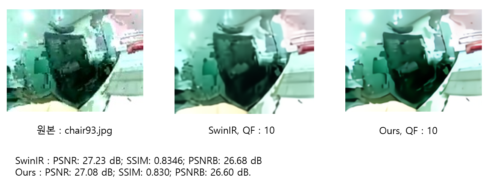

# 2023-Graduation-Project

---

# Development of Deblocking Techniques for Enhancing Low-Bandwidth, Low-Quality Video

---

## Abstract

---

> 
> 
> 
> 빅데이터에서 IoT는 데이터 수집을 담당하는 중요한 축이다. IoT의 통신은 주로 무선통신으로 이루어지며 그 중 LoRa는 장거리 통신으로 타 IoT 네트워크 대비 저전력, 저용량 면에서 큰 강점을 보인다. LoRa 모듈에서 이미지 전송은 작은 이미지 데이터를 H264로 압축하여 보내는 것으로 이루어진다. 이 때문에 수신 이미지는 심한 blur와 Blocking Artifact, 낮은 해상도를 보인다.
> 본 보고서는 이런 저대역 저화질 이미지에서 발생할 수 있는 열화를 개선하기 위해 quality factor을 예측하여 화질 개선에 적용할 수 있는 방법에 대해 기술한다.
> 

## Model architecture

---

## Results

---

### Artifact Removal

